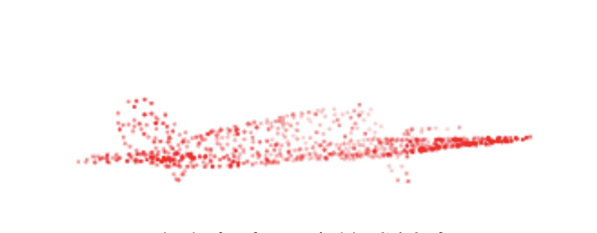
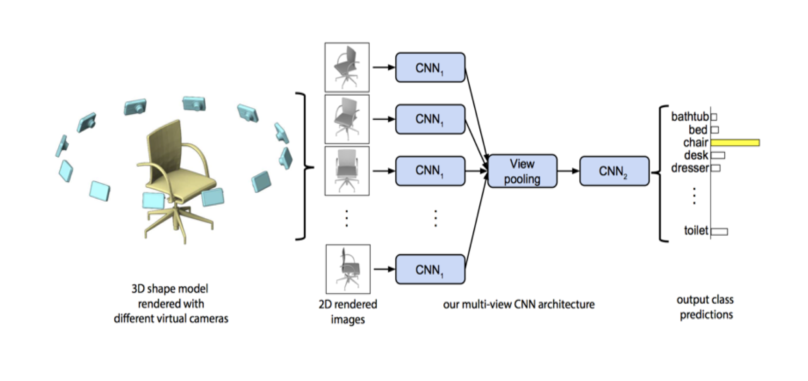
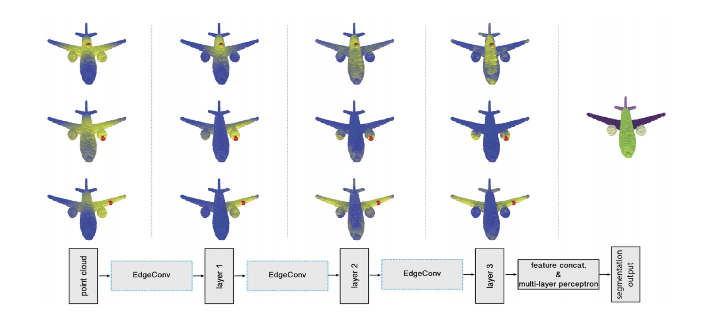
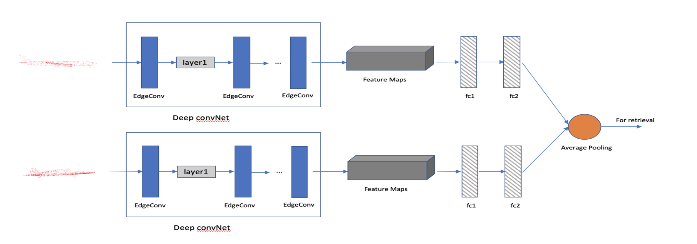

Residue Point Cloud Concatenation

Point Cloud is a kind of data which can be used to describe the 3D object, because of the limitaion of the Lidar. Sometimes we can only get some residue *point cloud data*.

 

Combine the ideas of *MVCNN* and *DGCNN* to make full use of the residue point cloud data.

My network looks like this. By this network, I combained the multi views of the residue point cloud.

In the retrieval task, I also pointed out a new loss function to enhance the accuracy. Finally, the accuracy imporved by *4.6%*.
